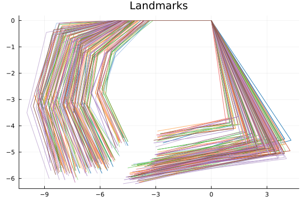
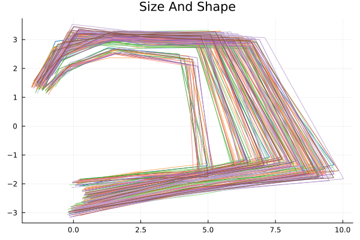

# **BayesSizeAndShape**

This package implements a Bayesian regression for size-and-shape data, based on "Di Noia, A., Mastrantonio, G., and Jona Lasinio, G., “Bayesian Size-and-Shape regression modelling”, <i>arXiv e-prints</i>, 2023". To install, simply do
```julia
julia> ]

pkg> add BayesSizeAndShape
```
at the julia prompt.
At the present moment, the package implements models for two- or three- dimensional data with reflection information. All the objects use `Float64` and `Int64` numbers

The function to use is `SizeAndShapeWithReflectionMCMC`

#
## **Basic Usage**

To fix notation, we assume the following
* `n` be the number of objects;
* `k+1` be the number of recorded landmark for each object
* `p` be the dimension of each landmark (only p=2 or p=3)

The model estimated is 
$$\text{vec}(\mathbf{Y}\_i \mathbf{R}\_i') \sim\mathcal{N}\_{k p}\left(  \text{vec}\left(\sum_{h=1}^dz\_{ih}\mathbf{B}\_h\right), \mathbf{I}\_p \otimes \boldsymbol{\Sigma}\right), \, i = 1, \dots , n$$
where
* $\mathbf{Y}\_i$ is the i-th size-and-shape object;
* $z_{ih}$ is a value of a covariate
* $\mathbf{B}\_h$ is a matrix that contains regressive coefficients
* $\boldsymbol{\Sigma}$ is a covariance matrix

The prior distributions are
$$
[\mathbf{B}_h]_{jl} \sim N(m,v),\,\,\,\,\,\,\,\,\,\, \boldsymbol{\Sigma} \sim IW(\nu, \Psi)
$$
### **Rats data example**

In the **examples** directory, there is the **julia** file **rats.jl** with an example of how to implement the model with the **rat** data, which we will describe also here. 


First we load the required packages

```julia
julia> using Random
julia> using Distributions
julia> using LinearAlgebra
julia> using StatsBase
julia> using Kronecker 
julia> using DataFrames
julia> using StatsModels 
julia> using CategoricalArrays
julia> using Plots
julia> using BayesSizeAndShape
```

The data for this example is inside the package and it can be loaded with 

```julia
julia> dataset_rats = dataset("rats");
```
and a description of the objects loaded can be seen with 
```julia
julia> dataset_desciption("rats")
```
There are different datasets in the package (in the package directory `data`), which are all taken from the R package **shape** (Soetaert K (2021). _shape: Functions for Plotting Graphical Shapes,
  Colors_. R package version 1.4.6,
  <https://CRAN.R-project.org/package=shape>). The names of the datasets that are ready to be used in **julia** can be found with the following command
```julia
julia> dataset_names()
```
The data `dataset_rats` is a three-dimensional array of landmark of dimension $(k+1)\times p \times n$. We put the landmark in a `landmark` object and we divide all the points by 100.0 to work with smaller number
```julia
julia> landmark = dataset_rats.x;
julia> landmark = landmark ./ 100.0
```
We can easily plot the data with
```julia
julia> plot(landmark[:,1,1], landmark[:,2,1],legend = false, color = cgrad(:tab20, 21)[Int64(subject[1])])
julia> for i = 2:size(landmark,3)
    plot!(landmark[:,1,i], landmark[:,2,i], color = cgrad(:tab20, 21)[Int64(subject[i])])
end
julia> title!("Landmarks")
```



<br />
<br />

Even tough we only need the array `landmark` in the MCMC function, we can compute the **SizeAndShape** data (the variables $\mathbf{Y}_i$) used inside the MCMC function with 
```julia
julia> sizeshape = sizeshape_helmertproduct_reflection(landmark);
```
where `sizeshape[:,:,i]` is $\mathbf{Y}_i$, and plot them with 

```julia
julia> plot(sizeshape[:,1,1], sizeshape[:,2,1],legend = false, color = cgrad(:tab20, 21)[Int64(subject[1])])
julia> for i = 2:size(landmark,3)
    plot!(sizeshape[:,1,i], sizeshape[:,2,i], color = cgrad(:tab20, 21)[Int64(subject[i])])
end
julia> title!("Size And Shape")
```


<br />
<br />


The `time` and `subject` information will be used as covariate, and with them we create a `DataFrame` 
```julia
julia> subject = dataset_rats.no;
julia> time = dataset_rats.time;
julia> covariates = DataFrame(
    time = time,
    subject = categorical(string.(subject))
);
```


<br />
<br />

Posterior samples are obtained with the function `SizeAndShapeWithReflectionMCMC`. 


The parameters are (in order)
* a three-dimensional `Array` of data;
* a `formula`, where on the left-hand side there must be 1 and on the right-hand side there is the actual regressive formula - an intercept is needed;
* a `DataFrame` of covariates. The formula search for the covariates in the `DataFrame` column names;
* a `NamedTuple` with `iter`, `burnin`, and `thin` values of the MCMC algorithm
* a `Normal` distribution that is used as prior for all regressive coefficients
* an `InverseWishart` distribution that is used as prior for the covariance matrix.


```julia
julia> outmcmc = SizeAndShapeWithReflectionMCMC(
    landmark,
    @formula(1 ~ 1+time + subject),
    covariates,
    (iter=1000, burnin=200, thin=2),
    Normal(0.0,100000.0),#
    InverseWishart(k + 2, 5.0 * Matrix{Float64}(I, k, k))
);
```
Posterior samples of the parameters can be extracted using the following: 
```julia
julia> betaout = posterior_samples_beta(outmcmc);
julia> sigmaout = posterior_samples_sigma(outmcmc);
```
where `betaout` is a `DataFrame` that contains the posterior samples of $\mathbf{B}_h$, while `sigmaout` is a `DataFrame` that contains the ones of $\boldsymbol{\Sigma}$. Each row is a posterior sample.

The column names of `betaout` are informative on which mark/dimension/covariates a specific regressive coefficient is connected
```julia
julia> names(betaout)
266-element Vector{String}:
 "(Intercept)| mark:1| dim:1"
 "(Intercept)| mark:2| dim:1"
 "(Intercept)| mark:3| dim:1"
 "(Intercept)| mark:4| dim:1"
 "(Intercept)| mark:5| dim:1"
 "(Intercept)| mark:6| dim:1"
 "(Intercept)| mark:7| dim:1"
 ⋮
 "subject: 9.0| mark:1| dim:2"
 "subject: 9.0| mark:2| dim:2"
 "subject: 9.0| mark:3| dim:2"
 "subject: 9.0| mark:4| dim:2"
 "subject: 9.0| mark:5| dim:2"
 "subject: 9.0| mark:6| dim:2"
 "subject: 9.0| mark:7| dim:2"
```
while the names of `sigmaout` indicates the row and column indices
```julia
julia> names(sigmaout)
49-element Vector{String}:
 "s_(1,1)"
 "s_(2,1)"
 "s_(3,1)"
 "s_(4,1)"
 "s_(5,1)"
 "s_(6,1)"
 "s_(7,1)"
 "s_(1,2)"
 ⋮
 "s_(1,7)"
 "s_(2,7)"
 "s_(3,7)"
 "s_(4,7)"
 "s_(5,7)"
 "s_(6,7)"
 "s_(7,7)"
```

It is possible to predict the **mean configuration** by using
the function
```julia
julia> predictive_mean = sample_predictive_zbr(outmcmc);
```
which compute the posterior samples of
$$
\boldsymbol{\mu}_i^* = \text{vec}\left(\sum_{h=1}^dz_{ih}\mathbf{B}_h \mathbf{R}_i\right)
$$
or from the predictive distribution
$$
\mathbf{X}_i^* = \text{vec}\left(\sum_{h=1}^dz_{ih}\mathbf{B}_h \mathbf{R}_i\right)+\boldsymbol{\epsilon}_{i} \,\,\,\,\,\,\,\,\ \boldsymbol{\epsilon}_{i}\sim\mathcal{N}_{k p}\left(  \mathbf{0}, \mathbf{I}_p \otimes \boldsymbol{\Sigma}\right)
$$
with the function 
```julia
julia> predictive_obs = sample_predictive_zbr_plus_epsilon(outmcmc);
```
Again, the names of the two `DataFrame`s `predictive_mean` and `predictive_obs` are informative to which element they refer to.

```julia
julia> names(predictive_mean)
2016-element Vector{String}:
 "mu_1,(1,1)"
 "mu_1,(2,1)"
 "mu_1,(3,1)"
 "mu_1,(4,1)"
 "mu_1,(5,1)"
 "mu_1,(6,1)"
 "mu_1,(7,1)"
 "mu_1,(1,2)"
 ⋮
 "mu_144,(1,2)"
 "mu_144,(2,2)"
 "mu_144,(3,2)"
 "mu_144,(4,2)"
 "mu_144,(5,2)"
 "mu_144,(6,2)"
 "mu_144,(7,2)"
```

```julia
julia> names(predictive_obs)
2016-element Vector{String}:
 "X_1,(1,1)"
 "X_1,(2,1)"
 "X_1,(3,1)"
 "X_1,(4,1)"
 "X_1,(5,1)"
 "X_1,(6,1)"
 "X_1,(7,1)"
 "X_1,(1,2)"
 ⋮
 "X_144,(1,2)"
 "X_144,(2,2)"
 "X_144,(3,2)"
 "X_144,(4,2)"
 "X_144,(5,2)"
 "X_144,(6,2)"
 "X_144,(7,2)"
```


## Citing

See `CITATION.bib`


